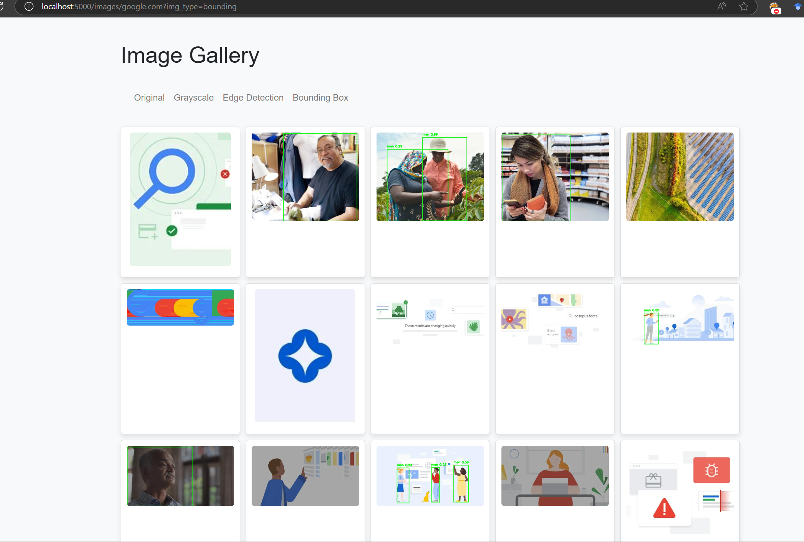

# Web Crawling Image Detection and Classification

A web crawling program that fetches image sources using Playwright. This tool is designed for dynamic websites where the DOM is rendered with JavaScript. It can extract images rendered via CSS and then process them using CNN for image classification and RCNN for object detection.

## Installation

1. **Clone the repository:**
   ```bash
   git clone https://github.com/dimasma0305/Web-Crawling-Image-Detection-and-Classification.git
   cd Web-Crawling-Image-Detection-and-Classification
   ```

2. **Install Python dependencies:**
   ```bash
   pip install -r requirements.txt
   ```

3. **Install Playwright browsers:**
   ```bash
   playwright install
   ```

## Training

Before running the application, you need to train the model. Execute the training script:

```bash
python trainer.py
```

This training uses the following dataset:

- [Gender Detection and Classification Image Dataset](https://www.kaggle.com/datasets/trainingdatapro/gender-detection-and-classification-image-dataset)

## Running the Application

After training is complete, start the application with:

```bash
python3 app.py
```

Once the application is running, open your browser and visit [http://localhost:5000](http://localhost:5000) to view the program.



## License

This project is licensed under the MIT License. See the [LICENSE](LICENSE) file for details.
